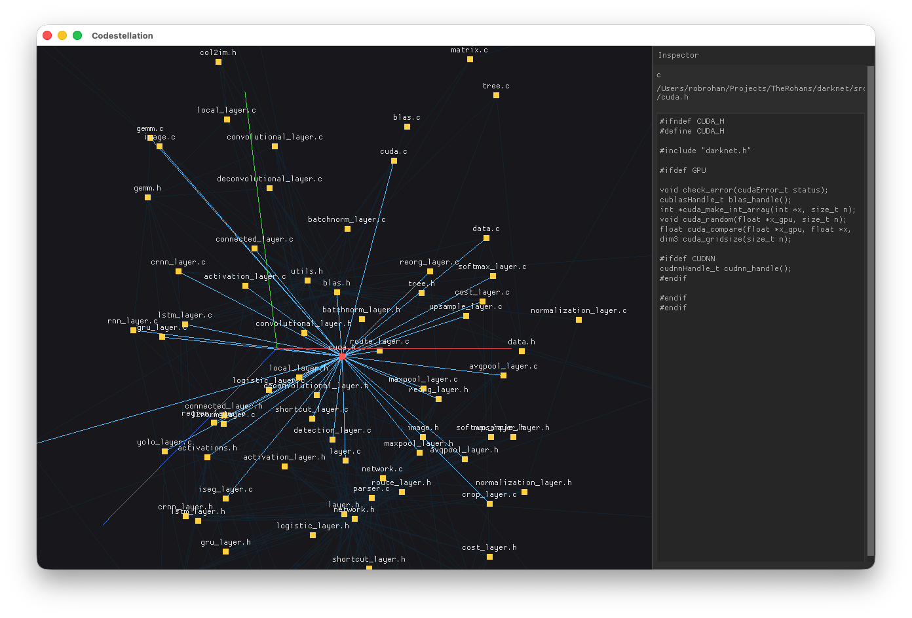

# Codestellation



Walks a codebase, extracts cross-file dependencies with tree-sitter, and
renders them as an interactive 3D graph in native OpenGL + Nuklear.
Built for digging through unfamiliar/legacy multi-language codebases.

Two binaries:
- `codemap-build` -- headless CLI. Walks a directory (recursively, mixed
  languages in one tree are fine), parses each file with the matching
  language adapter, and writes a dependency graph to `graph.json`.
- `codemap-view` -- loads a `graph.json`, lays it out in 3D once at
  startup, and opens a window to explore it.

Currently supported languages: **C** (`.c`/`.h`, `#include`-based),
**C#** (`.cs`, namespace/type declarations + `using`-qualified
references), **Lisp** (`.lisp`/`.lsp`/`.cl` -- a Common Lisp stand-in;
see the header comment in `src/lang/lisp/lisp_adapter.c` before trusting
it on a real codebase, the actual dialect wasn't confirmed when this was
written).

## Build

```
cmake -S . -B build
cmake --build build
```

Fetches tree-sitter + per-language grammars and GLFW via CMake
FetchContent on first configure (the C# grammar's generated parser is
large, so that step takes a bit). Verified on macOS; Windows/Linux
should work (a GL loader and the directory-walk code both have
non-Apple branches) but hasn't been run on real hardware in this
environment -- see the Phase 7 commit message for specifics.

### Xcode project

```
cmake -G Xcode -B build-xcode -S .
open build-xcode/Codestellation.xcodeproj
```

`build-xcode/` is gitignored. Xcode is a multi-config generator, so
don't pass `-DCMAKE_BUILD_TYPE` -- pick the configuration in Xcode, or
build from the CLI with `cmake --build build-xcode --config Debug`.
Editing `CMakeLists.txt` re-runs CMake automatically on the next build
via the generated `ZERO_CHECK` target.

This produces an ad-hoc-signed `codemap-view.app` (with `codemap-build`
embedded next to its executable) that runs straight from Xcode's Run
button. Hardened runtime is deliberately off here: with it on, Xcode's
injected `DYLD_*` environment makes dyld kill the fresh process that
Properties > Open spawns via `execv`.

For a Developer-ID-signed, hardened-runtime `.app` to hand to another
Mac:

```
cmake -G Xcode -B build-xcode -S . -DCODESTELLATION_DIST=ON
cmake --build build-xcode --config Release
```

Don't Run that build from Xcode -- launch the built `.app` directly
(Finder or `open`), where no `DYLD_*` injection happens.

## Run

```
./build/src/codemap-build --root <your-codebase-dir> --out graph.json
./build/src/codemap-view graph.json
```

In the viewer: left-drag empty space to orbit, scroll to zoom, click a
node to inspect its file in the right-hand panel, drag a node to
reposition it (it stays put -- layout is computed once at load, not a
continuous simulation). Esc to quit.

Optional sanity check of the graph output itself (needs networkx):
```
python3 scripts/sanity_check.py graph.json
```

## graph.json schema

networkx "node-link" format:

```json
{
  "directed": true,
  "graph": {},
  "nodes": [{"id": 0, "path": "/abs/path/foo.c", "language": "c"}],
  "links": [{"source": 0, "target": 1, "kind": "import"}]
}
```

Load in Python: `nx.node_link_graph(json.load(f), edges="links")`
(older networkx: drop the `edges` kwarg).

## Adding a language

Every language plugs into `src/lang/adapter.h`'s `LanguageAdapter`
struct -- the pipeline (`src/pipeline/*.c`) never references a specific
language by name, only through that interface. To add one: pick a
tree-sitter grammar, fetch it in the top-level `CMakeLists.txt`
(mirroring the existing `ts_c`/`ts_csharp`/`ts_lisp` blocks), and write
an adapter implementing `extract_declarations`/`extract_references`/
`resolve_reference`. `src/lang/c/c_adapter.c` is the simplest example
(no symbol table, path-based deps); `src/lang/csharp/csharp_adapter.c`
shows scoped namespace/type resolution by walking the parse tree
directly rather than a flat query; `src/lang/lisp/lisp_adapter.c` shows
adapting to a grammar with no dialect-specific node types at all.
