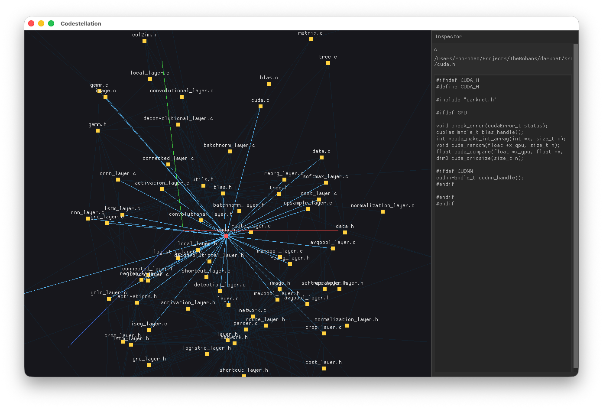

# Codestellation



Walks a codebase, extracts cross-file dependencies with tree-sitter, and
renders them as an interactive 3D graph in native OpenGL + Nuklear.
Built for digging through unfamiliar/legacy multi-language codebases.

One app, `codemap-view`: Properties > Open picks a directory, walks it
(recursively, mixed languages in one tree are fine), parses each file with
the matching language adapter, builds a dependency graph in the background,
and loads it into the 3D view -- no restart. The graph is cached as
`graph.json` in a per-project folder under
`~/Library/Application Support/Codestellation/`.

Currently supported languages: **C** (`.c`/`.h`, `#include`-based),
**C#** (`.cs`, namespace/type declarations + `using`-qualified
references), **Python** (`.py`/`.pyi`, `import` / `from ... import`,
including relative imports), **Go** (`.go`, `import` paths resolved to
packages by directory), **PHP**, **VB.NET**, **Lisp**
(`.lisp`/`.lsp`/`.cl` -- a Common Lisp stand-in; see the header comment in
`src/lang/lisp/lisp_adapter.c` before trusting it on a real codebase, the
actual dialect wasn't confirmed when this was written), and:

- **JavaScript** (`.js`/`.mjs`/`.cjs`/`.jsx`), **TypeScript**
  (`.ts`/`.mts`/`.cts`) and **TSX** (`.tsx`, React): `import`/`export ...
  from`, `require()`, dynamic `import()`. Relative imports resolve like
  Node/tsc/bundlers (extensions, `index` files, `./x.js` meaning `x.ts`);
  bare imports go through the nearest `tsconfig.json`/`jsconfig.json`
  (`baseUrl`, `paths` aliases, `extends`) before counting as packages.
- **JSON** (`.json`): files appear as nodes; `"$ref"` (JSON Schema /
  OpenAPI) and relative `"extends"` (tsconfig, eslint) link files.
  `package-lock.json` is skipped.
- **SQL** (`.sql`): `CREATE TABLE/VIEW/FUNCTION/...` declare objects;
  `FROM`/`JOIN`, `INSERT`/`UPDATE`/`DELETE`, `ALTER`, foreign keys and
  function calls reference them -- so migrations, views and queries link
  to the files that create what they use.
- **Protocol Buffers** (`.proto`): `import` paths, matched by path suffix
  since protoc's include roots aren't known.
- **Shell** (`.sh`/`.bash`): `source`/`.`, `./script.sh`, `bash script.sh`,
  including the `"$(dirname "$0")/lib.sh"` idiom.
- **PowerShell** (`.ps1`/`.psm1`/`.psd1`): dot-sourcing, `&` and direct
  runs, `Import-Module` (by path, module folder or name), `using module`,
  and `.psd1` manifest entries; `$PSScriptRoot` means the script's folder.
- **Batch** (`.bat`/`.cmd`): `call` (including `%~dp0`), running scripts
  directly, `start`, and scripts handed to `powershell -File` / `cmd /c`.
  PowerShell and batch scripts that call each other are linked.

The walker skips `node_modules`, `dist`, `.next`, `coverage`, `build`,
`vendor` and similar output directories, plus minified `*.min.js` files.

Python and Go have no in-source module identity -- `pkg.sub.mod` /
`example.com/m/pkg` come from where a file sits relative to a source
root (or `go.mod`) the adapter never sees -- so their dependency
resolution is a documented best-guess (path-suffix matching, plus
on-disk lookup for Python relative imports). See the header comments in
`src/lang/python/python_adapter.c` and `src/lang/go/go_adapter.c`.
Each adapter's header comment documents exactly what it recognises.

## Build

```
cmake -S . -B build
cmake --build build
```

Fetches tree-sitter + per-language grammars and GLFW via CMake
FetchContent on first configure (the C# grammar's generated parser is
large, so that step takes a bit). Verified on macOS; Windows/Linux
should work (a GL loader and the directory-walk code both have
non-Apple branches) but hasn't been run on real hardware in this
environment -- see the Phase 7 commit message for specifics.

### Xcode project

```
cmake -G Xcode -B build-xcode -S .
open build-xcode/Codestellation.xcodeproj
```

`build-xcode/` is gitignored. Xcode is a multi-config generator, so
don't pass `-DCMAKE_BUILD_TYPE` -- pick the configuration in Xcode, or
build from the CLI with `cmake --build build-xcode --config Debug`.
Editing `CMakeLists.txt` re-runs CMake automatically on the next build
via the generated `ZERO_CHECK` target.

This produces an ad-hoc-signed `Codestellation.app` that runs straight
from Xcode's Run button. Hardened runtime is deliberately off here, since
it refuses the `DYLD_*` injection Xcode's debugger relies on.

The Xcode build is universal (Apple Silicon + Intel) and targets macOS
12.0, the oldest Xcode 27 supports (override with
`-DCMAKE_OSX_ARCHITECTURES=...` / `-DCMAKE_OSX_DEPLOYMENT_TARGET=...`).
A `build-xcode/` configured before these defaults existed keeps its old
cached target (the build machine's macOS), so pass
`-DCMAKE_OSX_DEPLOYMENT_TARGET=12.0` once, or delete the folder and
reconfigure. The app icon is `resources/macos/Codestellation.icns`,
generated by `scripts/make_icon.py` (needs numpy).

For a Developer-ID-signed, hardened-runtime `.app` to hand to another
Mac:

```
cmake -G Xcode -B build-xcode -S . -DCODESTELLATION_DIST=ON
cmake --build build-xcode --config Release
```

Don't Run that build from Xcode -- launch the built `.app` directly
(Finder or `open`), where no `DYLD_*` injection happens. The signature
carries a secure timestamp, as notarization requires.

Or use Product > Archive, then Distribute App > Direct Distribution in the
Organizer, which signs with your Developer ID and notarizes in one go.
Note that Archive replaces `build-xcode/src/Release/Codestellation.app`
with a symlink into Xcode's DerivedData. If DerivedData is later cleaned, a
plain Release build fails with "unable to create directory ...
Codestellation.app": delete that dangling link and build again.

## Run

```
./build/src/codemap-view                       # then use the Properties panel
./build/src/codemap-view path/to/project.json  # open a system-map project
./build/src/codemap-view graph.json            # or a previously built graph
```

**Projects (system maps).** Properties > New Project... makes a
`project.json` (title, description, root canvas) plus `root.canvas` in a
folder you pick. Canvases are standard [JSON Canvas](https://jsoncanvas.org)
files, so Obsidian can open them too. On the canvas:

- double-click empty space to add a box; double-click a box or edge to edit
  it in the side panel (markdown for boxes, a label for edges, colours)
- drag a box to move it, its bottom-right corner to resize, one of its side
  dots to draw an edge to another box
- shift+click a box containing `[[something.canvas]]` to go into that canvas
  (created on first visit); the breadcrumb bar at the top walks back out
- shift+click a box whose `[[links]]` point at folders (relative to the
  canvas, or absolute) to open that code in the 3D explorer -- several
  folders are merged into one graph; Esc or a breadcrumb returns to the
  canvas. A box with both kinds goes into the canvas; its editor has an
  "Open code" button
- Cmd+F (Ctrl+F elsewhere) or the breadcrumb bar's Search button searches
  every canvas in the project. **Go** jumps to a result; **Link here** drops a
  *weak link* on the current canvas: a dashed, read-only box showing the
  original's live text, which you can connect edges to (e.g. a server in one
  region talking to a database in another). Shift+click a weak link to jump
  to the original
- Delete/Backspace removes the selection; Esc closes search or the editor,
  clears the selection, then goes up a level
- scroll to zoom, drag empty space (or right/middle-drag) to pan

Every change saves to the `.canvas` file automatically.

**Export.** With a project open, Properties > Export Manual... writes the
whole system map as one Markdown document: each canvas a section, each box a
subsection, groups nesting their boxes, edges listed as connections, and for
boxes with folder links a code summary (languages, file counts, most
depended-on files) plus your notes on the code. Export LLM Brief... writes
the same content framed as context for an AI assistant, with every
component's full breadcrumb path in its heading.

**Folders (3D explorer).** Properties > Open Folder... builds a directory's
dependency graph and shows it in 3D: left-drag empty space to orbit, scroll
to zoom, right-click a node to inspect its file, drag a node to reposition
it (it stays put -- layout is computed once at load, not a continuous
simulation). Esc quits from here.

Optional sanity check of a built graph (needs networkx), pointed at the
cached `graph.json` in the project's Application Support folder:
```
python3 scripts/sanity_check.py graph.json
```

## graph.json schema

networkx "node-link" format:

```json
{
  "directed": true,
  "graph": {},
  "nodes": [{"id": 0, "path": "/abs/path/foo.c", "language": "c"}],
  "links": [{"source": 0, "target": 1, "kind": "import"}]
}
```

Load in Python: `nx.node_link_graph(json.load(f), edges="links")`
(older networkx: drop the `edges` kwarg).

## Adding a language

Every language plugs into `src/lang/adapter.h`'s `LanguageAdapter`
struct -- the pipeline (`src/pipeline/*.c`) never references a specific
language by name, only through that interface. To add one: pick a
tree-sitter grammar, fetch it in the top-level `CMakeLists.txt`
(mirroring the existing `ts_c`/`ts_csharp`/`ts_lisp`/`ts_python`/`ts_go`
blocks), add the adapter `.c` and its `tree_sitter_*` library to
`src/CMakeLists.txt`'s `Codestellation` target, register it in
`src/lang/registry.c`, and write an adapter implementing
`extract_declarations`/`extract_references`/`resolve_reference`.
`src/lang/c/c_adapter.c` is the simplest example (no symbol table,
path-based deps, flat query); `src/lang/csharp/csharp_adapter.c` shows
scoped namespace/type resolution by walking the parse tree directly
rather than a flat query; `src/lang/python/python_adapter.c` and
`src/lang/go/go_adapter.c` show path-derived module identity matched by
suffix (Python also resolves relative imports against the filesystem);
`src/lang/lisp/lisp_adapter.c` shows adapting to a grammar with no
dialect-specific node types at all.
