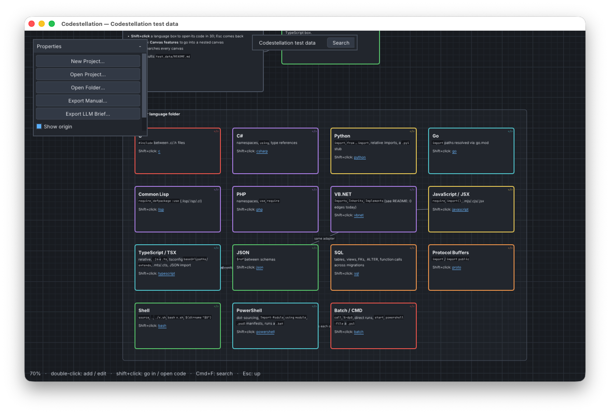
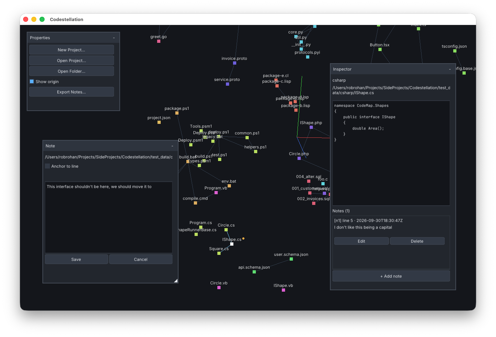

# Codestellation






## What it Does

The canvas view is for multi-level system diagrams. Draw boxes for servers,
services, databases, regions, or whatever your system is made of, connect
them with labelled lines, and nest them as deep as you like: shift+click a
box to go "into it" and diagram what's inside the box.

You can use a structure like the [C4 model](https://c4model.com) (context, containers, components, code) or make up your own levels. At the node of any diagram, a box
can point at folders of source code, which opens them in the 3D code view so you can comment
and see the source structure. Every box holds markdown notes, and the whole map can be searched or exported as a single document.

The codestellation view walks a codebase, extracts cross-file dependencies with
tree-sitter, and renders them as an interactive 3D graph in native OpenGL + Nuklear.

Codestellation is built for digging through unfamiliar, legacy, or "vibe coded" multi-language codebases, and it's export is meant to make a manual, or to feed back into an LLM.

## Supported languages

| Language | Extensions | What links files |
|---|---|---|
| C | `.c` `.h` | `#include` |
| C# | `.cs` | namespace/type declarations, `using`-qualified type references |
| Python | `.py` `.pyi` | `import`, `from ... import`, relative imports |
| Go | `.go` | `import` paths, resolved to packages by directory |
| PHP | `.php` | `require`/`include`; `namespace`, `use`, `extends`, `implements` |
| VB.NET | `.vb` | `Imports` and namespaces (see note) |
| Common Lisp | `.lisp` `.lsp` `.cl` | `in-package`, `require`, `defpackage :use` (see note) |
| JavaScript | `.js` `.mjs` `.cjs` `.jsx` | `import`/`export ... from`, `require()`, dynamic `import()` |
| TypeScript | `.ts` `.mts` `.cts` `.tsx` | as JavaScript, plus tsconfig/jsconfig `baseUrl`, `paths` and `extends` |
| JSON | `.json` | `"$ref"` (JSON Schema / OpenAPI), relative `"extends"` (tsconfig, eslint) |
| SQL | `.sql` | objects made by `CREATE TABLE/VIEW/FUNCTION/...`, used by `FROM`/`JOIN`, `INSERT`/`UPDATE`/`DELETE`, `ALTER`, foreign keys, function calls |
| Protocol Buffers | `.proto` | `import`, `import public` |
| Shell | `.sh` `.bash` | `source` / `.`, `./script.sh`, `bash script.sh`, `$(dirname "$0")/...` |
| PowerShell | `.ps1` `.psm1` `.psd1` | dot-sourcing, `&` and direct runs, `Import-Module` (path, module folder or name), `using module`, `.psd1` manifest entries |
| Batch | `.bat` `.cmd` | `call` (including `%~dp0`), direct runs, `start`, scripts passed to `powershell -File` / `cmd /c` |
| HTML | `.html` `.htm` | `src` / `href` attributes: `<script src>`, `<link href>`, `<a href>`, `<iframe src>` |
| CSS | `.css` | `@import`, and `url(...)` pointing at another stylesheet |
| Markdown | `.md` `.markdown` | `[text](path)` links, `[ref]: path` definitions, Obsidian `[[wiki links]]` and `![[embeds]]` |

Notes:

- **JavaScript / TypeScript:** relative imports resolve like Node, tsc and
  bundlers (extensions, `index` files, `./x.js` meaning `x.ts`). Bare imports
  go through the nearest `tsconfig.json`/`jsconfig.json` before counting as
  packages. TypeScript files can import JSON files.
- **SQL** links by object name, so migrations, views and queries point at the
  file that created what they use.
- **PowerShell and batch** scripts that call each other are linked.
  `$PSScriptRoot` and `%~dp0` mean "this script's folder".
- **HTML, CSS and Markdown** links are file paths, so they can point at any
  file whose adapter declares its path (C, JS/TS, JSON, PHP, Python, shell,
  and these three). Other sites, `#anchors`, `mailto:` and the like are
  skipped, as are images, fonts and media. A link starting with `/` is
  site-root relative; since the root isn't known, it's tried against each
  folder above the page. Inline `<script>` and `<style>` bodies aren't
  parsed. A Markdown `[[wiki link]]` finds the nearest note of that name,
  as Obsidian does.
- **Python, Go and Protocol Buffers** have no in-source module identity, so
  they match imports by path suffix -- a documented best guess. See the
  header comments in `src/lang/python/python_adapter.c` and
  `src/lang/go/go_adapter.c`.
- **VB.NET:** the pinned grammar misparses `Inherits` / `Implements` lines,
  so base-class and interface links don't appear; `Imports` do. See
  `src/lang/vbnet/vbnet_adapter.c`.
- **Common Lisp** is a stand-in for an unconfirmed dialect; read the header of
  `src/lang/lisp/lisp_adapter.c` before trusting it on a real codebase.
- Each adapter's header comment documents exactly what it recognises, and
  `test_data/` has a small sample project for every language.

The walker skips `node_modules`, `dist`, `.next`, `coverage`, `build`,
`vendor` and similar output directories, plus minified `*.min.js` files.

## Build

```
cmake -S . -B build
cmake --build build
```

Fetches tree-sitter + per-language grammars and GLFW via CMake
FetchContent on first configure (the C# grammar's generated parser is
large, so that step takes a bit). Verified on macOS; Windows/Linux
should work (a GL loader and the directory-walk code both have
non-Apple branches) but hasn't been run on real hardware in this
environment -- see the Phase 7 commit message for specifics.

### Xcode project

```
cmake -G Xcode -B build-xcode -S .
open build-xcode/Codestellation.xcodeproj
```

`build-xcode/` is gitignored. Xcode is a multi-config generator, so
don't pass `-DCMAKE_BUILD_TYPE` -- pick the configuration in Xcode, or
build from the CLI with `cmake --build build-xcode --config Debug`.
Editing `CMakeLists.txt` re-runs CMake automatically on the next build
via the generated `ZERO_CHECK` target.

This produces an ad-hoc-signed `Codestellation.app` that runs straight
from Xcode's Run button. Hardened runtime is deliberately off here, since
it refuses the `DYLD_*` injection Xcode's debugger relies on.

The Xcode build is universal (Apple Silicon + Intel) and targets macOS
12.0, the oldest Xcode 27 supports (override with
`-DCMAKE_OSX_ARCHITECTURES=...` / `-DCMAKE_OSX_DEPLOYMENT_TARGET=...`).
A `build-xcode/` configured before these defaults existed keeps its old
cached target (the build machine's macOS), so pass
`-DCMAKE_OSX_DEPLOYMENT_TARGET=12.0` once, or delete the folder and
reconfigure. The app icon is `resources/macos/Codestellation.icns`,
generated by `scripts/make_icon.py` (needs numpy).

For a Developer-ID-signed, hardened-runtime `.app` to hand to another
Mac:

```
cmake -G Xcode -B build-xcode -S . -DCODESTELLATION_DIST=ON
cmake --build build-xcode --config Release
```

Don't Run that build from Xcode -- launch the built `.app` directly
(Finder or `open`), where no `DYLD_*` injection happens. The signature
carries a secure timestamp, as notarization requires.

Or use Product > Archive, then Distribute App > Direct Distribution in the
Organizer, which signs with your Developer ID and notarizes in one go.
Note that Archive replaces `build-xcode/src/Release/Codestellation.app`
with a symlink into Xcode's DerivedData. If DerivedData is later cleaned, a
plain Release build fails with "unable to create directory ...
Codestellation.app": delete that dangling link and build again.

## Run

```
./build/src/codemap-view                       # then use the Properties panel
./build/src/codemap-view path/to/project.json  # open a system-map project
./build/src/codemap-view graph.json            # or a previously built graph
```

**Projects (system maps).** Properties > New Project... makes a
`project.json` (title, description, root canvas) plus `root.canvas` in a
folder you pick. Canvases are standard [JSON Canvas](https://jsoncanvas.org)
files, so Obsidian can open them too. On the canvas:

- double-click empty space to add a box; double-click a box or edge to edit
  it in the side panel (markdown for boxes, a label, arrows and colour for
  edges)
- drag a box to move it, its bottom-right corner to resize, one of its side
  dots to draw an edge to another box. Edges reattach to the facing sides as
  boxes move; tick "Lock sides" in an edge's editor to pin it where it is
- Cmd/Ctrl+right-drag to draw a group: a labelled frame behind the boxes, for
  notes or a rough grouping while you work something out (moving it doesn't
  carry the boxes inside along)
- shift+click a box containing `[[something.canvas]]` to go into that canvas
  (created on first visit); the breadcrumb bar at the top walks back out
- shift+click a box whose `[[links]]` point at folders (relative to the
  canvas, or absolute) to open that code in the 3D explorer -- several
  folders are merged into one graph; Esc or a breadcrumb returns to the
  canvas. A box with both kinds goes into the canvas; its editor has an
  "Open code" button
- Cmd+F (Ctrl+F elsewhere) or the breadcrumb bar's Search button searches
  every canvas in the project. **Go** jumps to a result; **Link here** drops a
  *weak link* on the current canvas: a dashed, read-only box showing the
  original's live text, which you can connect edges to (e.g. a server in one
  region talking to a database in another). Shift+click a weak link to jump
  to the original
- Delete/Backspace removes the selection; Esc closes search or the editor,
  clears the selection, then goes up a level
- scroll to zoom, drag empty space (or right/middle-drag) to pan

Every change saves to the `.canvas` file automatically.

**Export.** With a project open, Properties > Export Manual... writes the
whole system map as one Markdown document: each canvas a section, each box a
subsection, groups nesting their boxes, edges listed as connections, and for
boxes with folder links a code summary (languages, file counts, most
depended-on files) plus your notes on the code. Export LLM Brief... writes
the same content framed as context for an AI assistant, with every
component's full breadcrumb path in its heading.

**Folders (3D explorer).** Properties > Open Folder... builds a directory's
dependency graph and shows it in 3D: left-drag empty space to orbit, scroll
to zoom, right-click a node to inspect its file, drag a node to reposition
it (it stays put -- layout is computed once at load, not a continuous
simulation). Esc quits from here. Longer files are drawn bigger (on a log
scale of line count; see `src/render/nodestyle.h`).

The Inspector shows the selected file with line numbers, wrapped to the
panel's width. A dot in the margin marks a line with a note: click it to
open the note, or click any line number to add a note to that line. A red
ring marks where each of the file's most complex functions starts (up to
five, complexity 10 and up); hover it for the function's name and score.
A blue bar down the margin marks code that also appears somewhere else in
the project, in any file or folder (or elsewhere in the same file); hover it
for the list of other places, as `path:first-last` lines. A copy is at
least 50 tokens over 5 lines, compared token by token, so layout and comments
don't matter but renamed variables do. Only code files are compared (the
languages with complexity, below), only against the same language, and files
over 1 MB are skipped as generated.

**File stats.** The Inspector's collapsible Stats section shows, for the
selected file:

- **Lines**, blank lines, and lines with comments on them.
- **Indentation**: the deepest indent, in the file's own indent steps. It
  works in any language and stands in for nesting depth.
- **Complexity**: decision points + 1 (`if`, loops, `case`, `catch`, `?:`,
  `&&`/`||`...), with the function count and the most complex function.
  Only for languages with real control flow: "n/a" for JSON, CSS, HTML,
  Markdown, proto, SQL and Lisp (that grammar has no `if` node to count).
- **Depended on by / depends on**: distinct files, and the **blast radius**:
  how many files depend on this one directly or through others (skipped on
  graphs of more than about 20,000 files).
- **In a cycle**: the other files in its dependency cycle, if any.
- **Unresolved refs** and **parse errors**: how far to trust this file's
  edges.
- **Git history**: commits, authors and last commit date (merges skipped,
  renames not followed), and the **hotspot** rank: commits x complexity,
  highest first. Files whose folder isn't in a git repo show none of this.
  On macOS git is only run when the developer tools are installed.

Stats are worked out when the graph is built, so a `graph.json` from an
older build shows a note to reopen the folder instead.

Optional sanity check of a built graph (needs networkx), pointed at the
cached `graph.json` in the project's Application Support folder:
```
python3 scripts/sanity_check.py graph.json
```

## graph.json schema

networkx "node-link" format:

```json
{
  "directed": true,
  "graph": {},
  "nodes": [{"id": 0, "path": "/abs/path/foo.c", "language": "c",
             "lines": 120, "complexity": 14, "fan_in": 3, "git_commits": 9, ...}],
  "links": [{"source": 0, "target": 1, "kind": "import"}],
  "clones": [{"a": 0, "a_line": 40, "a_end": 78, "b": 5, "b_line": 120, "b_end": 158}]
}
```

Each node also carries the file stats: `lines`, `blank_lines`,
`comment_lines`, `max_indent`, `parse_errors`, `complexity`, `functions`,
`max_function_complexity`, `fan_in`, `fan_out`, `blast_radius`, `cycle_id`
(files sharing one form a cycle), `cycle_size`, `unresolved`,
`git_commits`, `git_authors`, `git_last_commit` (unix seconds),
`hotspot_rank`, and `hot_functions` (`[{"line", "complexity", "name"}]`,
the most complex functions first). A key that doesn't apply is left out, e.g. no `complexity`
for JSON and no `git_*` outside a repo. See `NodeStats` in `src/graph/graph.h`.

`clones` lists duplicated code: lines `a_line`-`a_end` of node `a` match
lines `b_line`-`b_end` of node `b` (1-based, inclusive; `a` and `b` can be
the same file). networkx ignores the key. See `src/pipeline/dupes.h`.

Load in Python: `nx.node_link_graph(json.load(f), edges="links")`
(older networkx: drop the `edges` kwarg).

## Adding a language

Every language plugs into `src/lang/adapter.h`'s `LanguageAdapter`
struct -- the pipeline (`src/pipeline/*.c`) never references a specific
language by name, only through that interface. To add one: pick a
tree-sitter grammar, fetch it in the top-level `CMakeLists.txt`
(mirroring the existing `ts_c`/`ts_csharp`/`ts_lisp`/`ts_python`/`ts_go`
blocks), add the adapter `.c` and its `tree_sitter_*` library to
`src/CMakeLists.txt`'s `Codestellation` target, register it in
`src/lang/registry.c`, and write an adapter implementing
`extract_declarations`/`extract_references`/`resolve_reference`.
For complexity stats, also set `branch_types` and `function_types`: lists of
the grammar's node type names for decision points and functions (check them
against the grammar's `src/node-types.json`; leave them NULL for data or
markup languages).
`src/lang/c/c_adapter.c` is the simplest example (no symbol table,
path-based deps, flat query); `src/lang/csharp/csharp_adapter.c` shows
scoped namespace/type resolution by walking the parse tree directly
rather than a flat query; `src/lang/python/python_adapter.c` and
`src/lang/go/go_adapter.c` show path-derived module identity matched by
suffix (Python also resolves relative imports against the filesystem);
`src/lang/lisp/lisp_adapter.c` shows adapting to a grammar with no
dialect-specific node types at all.
